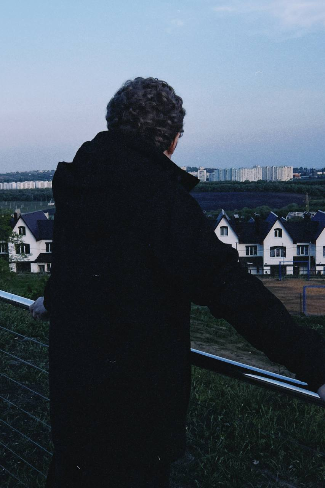

<table border="0">
  <tr>
    <td width="75%">
      <h1>[ JitterGlitch ] 🌀💻</h1>
      <h3>Full-stack Developer</h3>
      <blockquote>"Хочешь выделяться — уделяй себе время."</blockquote>
    </td>
    <td width="25%" align="center">
      
    </td>
  </tr>
</table>

---

## 🛠 Текущий проект: **The Hub** 🔮
*Приватная экосистема для автоматизации и управления процессами учебной группы.*

- **Core Logic:** Управление расписанием и дежурствами (Duty Management System).
- **Modern Stack:** Сборка и оптимизация UI через **Vite** для мгновенного отклика.
- **Mobile Porting:** Полноценное портирование веб-стека на **Android** (Capacitor), обеспечивающее нативный опыт.
- **Backend & Infra:** Полный цикл администрирования: настройка и деплой на собственные **VDS** (Virtual Dedicated Servers).

---

## 💻 Tech Stack & Environment

  

- **OS:** Arch Linux (Main environment).
- **Knowledge Base:** Obsidian (Second Brain для графа связей и логов).

---

## 🏗️ Личный билд (Aesthetic Engineering)

Я не разделяю дисциплину в коде и дисциплину во внешности. Мой образ — это результат системного подхода к «железу» и «софту»:

- **[Hardware] Натуральные кудри (Type 3B):** Сложная природная структура, поддерживаемая через строгий алгоритм ухода. Для меня это ежедневный тест на внимание к деталям и умение управлять ресурсами. Мой внешний вид — это мой личный бренд. 🌀✨
- **[Mindset] Глубина и Автономия:** Предпочитаю работать в состоянии глубокого потока (Flow State). Верю, что настоящий результат рождается в тишине и при полном контроле над своей системой.

---

## 📡 Статус
- **Current Mode:** Глубокий кодинг, рефакторинг реальности.

---

  

